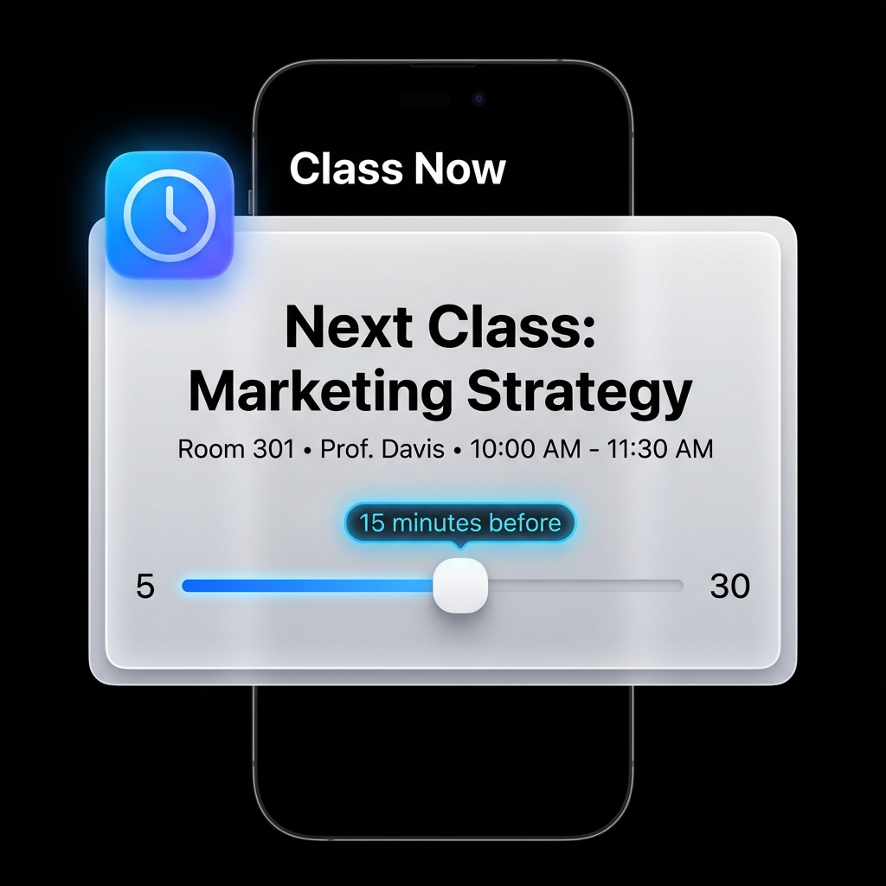
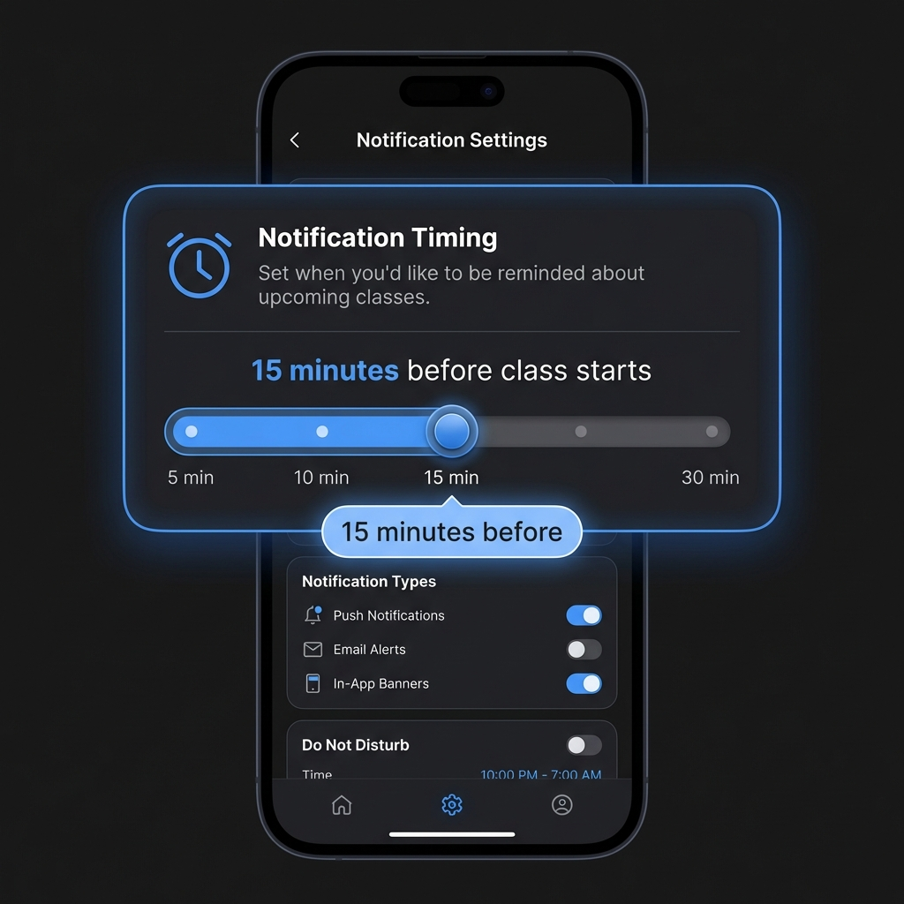

# ⏰ Timewise - Premium Class Timetable App

<div align="center">


**A luxury timetable management app with Apple-inspired glassmorphism UI**

[Features](#-features) • [Screenshots](#-screenshots) • [Tech Stack](#-tech-stack) • [Installation](#-installation) • [Usage](#-usage)

</div>

---

## ✨ Features

### 🎨 **Premium Apple-Inspired UI**
- **Glassmorphism Effects** - Frosted glass cards with blur and depth
- **Vibrant iOS Colors** - Official Apple design system colors (#007AFF, #5E5CE6, #FF2D55)
- **True OLED Black Theme** - Perfect contrast, saves battery
- **Smooth Animations** - Micro-interactions and gradient effects
- **Premium Typography** - San Francisco-style fonts, perfect spacing

### 📅 **Smart Timetable Management**
- **Live Class Tracking** - See current, upcoming, and completed classes
- **Progress Indicators** - Visual progress bars for ongoing classes
- **Day Navigation** - Quick switch between days of the week
- **Offline First** - Works perfectly without internet
- **Real-time Sync** - Instant updates when online

### 🔔 **Advanced Notifications**
- **Customizable Timing** - Get notified 5, 10, 15, or 30 minutes before class
- **Subject Filtering** - Choose which subjects to get alerts for
- **Smart Scheduling** - Notifications sent BEFORE class starts (not during!)
- **Test Mode** - Built-in notification tester

### 🏠 **Home Screen Widgets**
- **Live Timetable Widget** - See your schedule without opening the app
- **Manual Refresh** - Tap to update instantly
- **Battery Optimized** - Efficient background updates
- **Multiple Sizes** - Small and large widget options

### 👨‍🏫 **Dual Role System**
- **Student Mode** - Clean, focused class view
- **Mentor Mode** - Schedule management, announcements, and admin controls
- **Email/Password Auth** - Secure mentor authentication
- **Anonymous Access** - Frictionless student experience

### 🤖 **Robot Eyes Integration**
- **Arduino-Powered Animations** - Happy, Angry, Tired, Confused moods
- **Real-time Updates** - Responds to app state
- **Cloud Functions** - Firebase integration for remote control

### 📢 **Announcement System**
- **Real-time Updates** - Instant notifications from mentors
- **Rich Content** - Formatted announcements with timestamps
- **Persistent Storage** - Cached locally for offline viewing

---

## 📱 Screenshots

<div align="center">

| Glassmorphism UI | Notification Settings | Live Classes |
|:---:|:---:|:---:|
|  |  |  |

| Home Widget | Dark Mode | Onboarding |
|:---:|:---:|:---:|
|  |  |  |

</div>

---

## 🛠️ Tech Stack

### **Core**
- **Flutter 3.x** - Cross-platform framework
- **Dart 3.x** - Modern, type-safe language
- **Material Design 3** - Latest design system

### **Backend & Database**
- **Firebase Firestore** - Real-time NoSQL database
- **Firebase Auth** - Email/password & anonymous authentication
- **Cloud Functions** - Serverless backend for Robot Eyes

### **State Management**
- **Provider** - Simple, efficient state management
- **SharedPreferences** - Local persistent storage

### **Background Processing**
- **Workmanager** - Reliable background tasks
- **Android Alarm Manager Plus** - Precise scheduling
- **Flutter Local Notifications** - Rich notification system

### **UI Components**
- **Custom Glassmorphism Widgets** - Premium UI components library
- **Google Fonts** - Beautiful typography
- **Shimmer** - Skeleton loading states
- **Home Widget** - Native home screen widgets

### **Development Tools**
- **Git** - Version control
- **Android Studio** - IDE and debugging
- **Firebase Console** - Backend management

---

## 🚀 Installation

### Prerequisites
- Flutter SDK (3.0.0 or higher)
- Dart SDK (3.0.0 or higher)
- Android Studio or VS Code
- Firebase account
- Git

### Setup Instructions

1. **Clone the repository**
   ```bash
   git clone https://github.com/shantoshdurai/Timewise-app.git
   cd Timewise-app
   ```

2. **Install dependencies**
   ```bash
   flutter pub get
   ```

3. **Firebase Configuration**
   
   Create a Firebase project at [firebase.google.com](https://firebase.google.com)
   
   **Android:**
   - Download `google-services.json`
   - Place it in `android/app/`
   
   **Enable Authentication:**
   - Go to Firebase Console → Authentication
   - Enable Email/Password provider
   - Enable Anonymous provider

   **Setup Firestore:**
   - Create a Firestore database
   - Use the following structure:
     ```
     departments/
       ├── {deptId}/
           ├── years/
               ├── {yearId}/
                   ├── sections/
                       ├── {sectionId}/
                           ├── schedule/
                               ├── {classId}
     ```

4. **Run the app**
   ```bash
   flutter run
   ```

---

## 📖 Usage

### For Students

1. **Launch the app** - Automatic anonymous sign-in
2. **Select your department, year, and section** during onboarding
3. **View your timetable** - See live, upcoming, and completed classes
4. **Enable notifications** - Go to Settings → Notification Preferences
5. **Customize timing** - Choose when to get reminders (5-30 min before)
6. **Add home widget** - Long-press home screen → Widgets → Timewise

### For Mentors

1. **Login with email/password** - Use mentor credentials
2. **Manage schedules** - Add, edit, or delete classes
3. **Post announcements** - Share important updates with students
4. **View analytics** - Track class attendance and engagement

### Notification Settings

1. Open **Settings** → **Notification Preferences**
2. Toggle **Enable Notifications**
3. Adjust **Notification Timing** (5, 10, 15, or 30 minutes before)
4. Choose **All Classes** or **Select Specific Subjects**
5. Tap **Send Test Notification** to verify

---

## 🎨 Premium UI Components

### Glassmorphism Cards
```dart
import 'package:flutter_firebase_test/widgets/glass_widgets.dart';

GlassCard(
  blur: 15,
  opacity: 0.08,
  child: YourContent(),
)
```

### Glowing Effects
```dart
GlowingCard(
  glowColor: AppTheme.primaryBlue,
  glowRadius: 12,
  child: Badge(),
)
```

### Gradient Cards
```dart
GradientCard(
  gradientColors: [AppTheme.primaryBlue, AppTheme.accentPurple],
  animated: true,
  child: Content(),
)
```

---

## 🏗️ Project Structure

```
lib/
├── main.dart                      # App entry point
├── app_theme.dart                 # Premium Apple-inspired theme
├── splash_screen.dart             # Animated splash screen
├── onboarding_screen.dart         # Class selection flow
├── notification_service.dart      # Smart notification system
├── notification_settings_page.dart # Premium settings UI
├── widget_service.dart            # Home widget management
├── subject_utils.dart             # Subject icon mapping
└── widgets/
    └── glass_widgets.dart         # Glassmorphism components

android/
├── app/
    ├── src/main/
        ├── kotlin/                # Widget providers
        └── res/layout/            # Widget layouts
```

---

## 🔧 Configuration

### Customize Colors
Edit `lib/app_theme.dart`:
```dart
static const Color _primaryBlue = Color(0xFF007AFF);
static const Color _accentPurple = Color(0xFF5E5CE6);
```

### Adjust Notification Lead Time
Default options: 5, 10, 15, 30 minutes
Edit in `notification_service.dart`

### Widget Update Frequency
Configure in `widget_service.dart`

---

## 🤝 Contributing

Contributions are welcome! Here's how:

1. **Fork the repository**
2. **Create a feature branch**
   ```bash
   git checkout -b feature/amazing-feature
   ```
3. **Commit your changes**
   ```bash
   git commit -m 'Add amazing feature'
   ```
4. **Push to your fork**
   ```bash
   git push origin feature/amazing-feature
   ```
5. **Open a Pull Request**

### Contribution Guidelines
- Follow Flutter best practices
- Maintain the Apple-inspired design language
- Add tests for new features
- Update documentation
- Keep commits atomic and well-described

---

## 🐛 Known Issues & Roadmap

### Known Issues
- Widget may not appear immediately on some Android launchers (workaround: restart device)
- Glassmorphism may lag on very old devices (optimization in progress)

### Roadmap
- [ ] iOS support
- [ ] Multi-language support
- [ ] Calendar integration
- [ ] Attendance tracking
- [ ] Push notifications via FCM
- [ ] Desktop support (Windows, macOS, Linux)
- [ ] Web version
- [ ] Biometric authentication

---

## 📄 License

This project is licensed under the MIT License - see the [LICENSE](LICENSE) file for details.

---

## 🙏 Acknowledgments

- **Flutter Team** - Amazing framework
- **Firebase** - Powerful backend
- **Apple** - Design inspiration
- **Material Design** - Component guidelines
- **Open Source Community** - Invaluable packages

---

## 📞 Contact & Support

- **Developer:** Shantosh Durai
- **GitHub:** [@shantoshdurai](https://github.com/shantoshdurai)
- **Repository:** [Timewise-app](https://github.com/shantoshdurai/Timewise-app)

### Support
- 🐛 Found a bug? [Open an issue](https://github.com/shantoshdurai/Timewise-app/issues)
- 💡 Have an idea? [Start a discussion](https://github.com/shantoshdurai/Timewise-app/discussions)
- ⭐ Like the project? Give it a star!

---

<div align="center">

### Made with ❤️ and ☕ for students and educators

**Star ⭐ this repo if you find it helpful!**

</div>
